  

<h1 align="center">👋 Welcome to my GitHub Space!</h1>

  <strong>AI/ML Engineer &amp; Researcher</strong> • Deep Learning Enthusiast • Patent Holder

  I am an AI/ML undergraduate specialising in developing, optimizing, and advancing deep learning architectures for real-world impact. My work spans computer vision, medical AI, RAG systems, and neural network compression.

  
  
  
  

---

## 🚀 Featured Projects

<table width="100%">
  <tr>
    <td width="50%" valign="top">
      <h3>🤖 <a href="https://github.com/Aragog540/Tarka">Tarka</a></h3>
      
<em>Multi-agent research system powered by LangGraph, Google Search, and persistent memory.</em>

      

        
        
      

    </td>
    <td width="50%" valign="top">
      <h3>🏥 <a href="https://github.com/Aragog540/RAG-Based-Health-Bot">RAG-Based Health Bot</a></h3>
      
<em>Local-first medical RAG chatbot using FastAPI, LangGraph, ChromaDB, and Ollama.</em>

      

        
        
        
      

    </td>
  </tr>
  <tr>
    <td width="50%" valign="top">
      <h3>🌁 <a href="https://github.com/Aragog540/Sat-dhze">Sat-dhze</a></h3>
      
<em>Satellite image single-sensor dehazing using CNN-based Conditional Generative Adversarial Networks (cGAN).</em>

      

        
        
        
      

    </td>
    <td width="50%" valign="top">
      <h3>📈 <a href="https://github.com/Aragog540/Enhanced-Mamba-decoder-with-spatial-attention-and-adaptive-weighting.">UNetMamba Spatial Attention</a></h3>
      
<em>Enhanced UNetMamba integrating multi-scale spatial attention and adaptive weights for high-resolution segmentation.</em>

      

        
        
        
      

    </td>
  </tr>
</table>

---

## 🏆 Publications &amp; Patents

- **📄 Published Research Paper (IEEE SCEECS 2025)**  
  *Satellite single-sensor image dehazing using CNN-based Conditional Generative Adversarial Networks (cGAN).* Achieved a stellar **99% dehazing accuracy**.
- **💡 Design Registration (Patent Office, Govt. of India)**  
  Awarded a design registration for an innovative, multipurpose vegetable chopping board.
- **🥇 Raman Research Award**  
  Honored with the university's Raman Research Award for excellence in published research.

---

## 💻 Tech Stack

<table>
  <tr>
    <td valign="top" width="33%">
      <strong>🧠 AI &amp; Machine Learning</strong>  
       
       
       
       
       
      
    </td>
    <td valign="top" width="33%">
      <strong>🛠️ Languages &amp; Frameworks</strong>  
       
       
       
      
    </td>
    <td valign="top" width="33%">
      <strong>⚙️ MLOps, Cloud &amp; Tools</strong>  
       
       
       
       
      
    </td>
  </tr>
</table>

---

## 📊 GitHub Metrics

  

  
  

---

  <em>🕉️ Bhagavad Gita 2.47</em>

<blockquote>
  

    <strong>“Karmanye vadhikaraste ma phaleshu kadachana, Ma karma phala hetur bhur ma te sangostvakarmani.”</strong>
  

  

    <em>“You have a right to perform your prescribed duties, but you are not entitled to the fruits of your actions. Never consider yourself the cause of the results of your activities, nor be attached to inaction.”</em>
  

</blockquote>

<!-- Proudly created with high-fidelity custom design styling -->
